# TP FINAL SECUS_OS LINUX #

# Enumération
- "ls -la" :
- "locate/find" :
- "grep" :
- "nmap" :

# Exploitation
- "cours" :
- "GTFOBins" : 

# Vulnérabilité 1 #
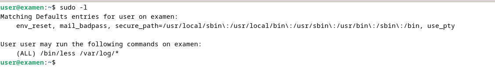

**Description**
- "user ALL(ALL) /bin/less /var/log/*" : Cette autorisation nous donne les droits root lorsque on utilisera "less" sur le chemin "/var/log/*" le souci étant que "*" fait référence au répertoire parent et permet donc de remonter dans l'arboréscence avec les droits root. Nous pouvons donc afficher le "/etc/shadow" et récupérer le hash de l'utilisateur "root" et des autres utilisateurs.

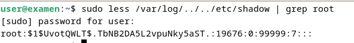

**Rémédiation**
- Faire une regex pour filtrer l'accès à "/var/log/" comme "user ALL=(ALL) /bin/less ^/var/log/[a-zA-Z0-9_/]+\.?[a-zA-Z0-9_]*$".

# Vulnérabilité 2 #

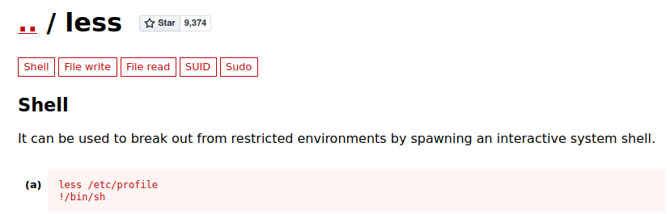

**Description**
- "less" : Cette autorisation nous donne les droits root lorsque on utilisera "less" sur le chemin "/var/log/*" le souci étant que la commande "less" est vulnérable à l'exécution de commande. Lorsque nous ouvrons un fichier dans le repertoire "/var/log/" avec less (donc avec les droits root) puis que nous faisons ":" puis "!/bin/bash" nous avons ensuite un shell root.

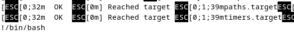

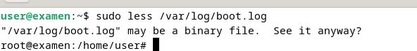

**Rémédiation**
- Ne pas utiliser la commande "less".

# Vulnérabilité 3 #
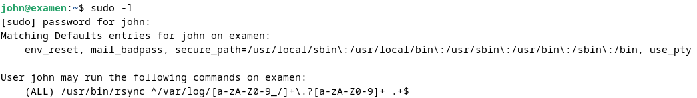

**Description**
- "john ALL=(ALL) /usr/bin/rsync ^/var/log/[a-zA-Z0-9_/]+\.?[a-zA-Z0-9]+ .+$" : Cette autorisation nous donne les droits root lorsque on utilise "rsync" sur le chemin "/var/log/". Le chemin est filtré avec une "regex" afin d'éviter de pouvoir remonter dans l'arboréscence des répertoires. Le soucis étant que "rsync" est vulnérable à l'injection de commande. Cette commande "sudo rsync /var/log/boot.log -e 'sh -c "sh 0<&2 1>&2"' 127.0.0.1:/dev/null", permet d'avoir un shell root.

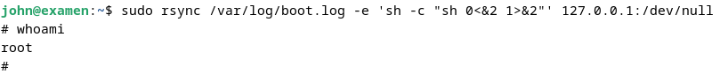

**Rémédiation**
- Mettre l'attribu "NOEXEC" dans le fichier de configuration se trouvant dans /etc/sudoers.d/ afin d'empécher l'injection de commande.

# Vulnérabilité 4 #

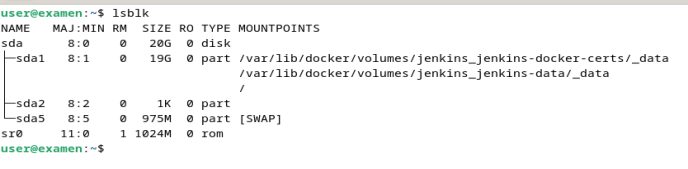

**Description**
- Le disque n'est pas chiffré, nous pouvons donc changer le mot de passe root si nous avons la mains sur le pc.

**Rémédiation**
- Chiffrer le disque, nottament avec Lucks.

# Vulnérabilité 5 #
**Description**
- Les mots de passe des utilisateurs sont identiques à leurs nom d'utilisateurs par exemple : root/root, user/user, john/john.

**Rémédiation**
- Mettre des mots de passe robuste pour chaques utilisateurs.

# Vulnérabilité 6 #

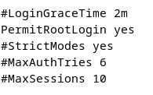

**Description**
- Par défaut, sshd ne permet pas de se connecter en ssh avec l'utilisateur "root". Ici nous pouvons le faire à cause de la configuration : "PermitRootLogin: yes"

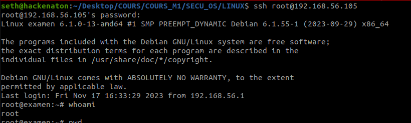

**Rémédiation**
- Mettre le paramettre sur "no" et redémarrer la machine afin que le changement soit pris en compte.

# Vulnérabilité 7 #

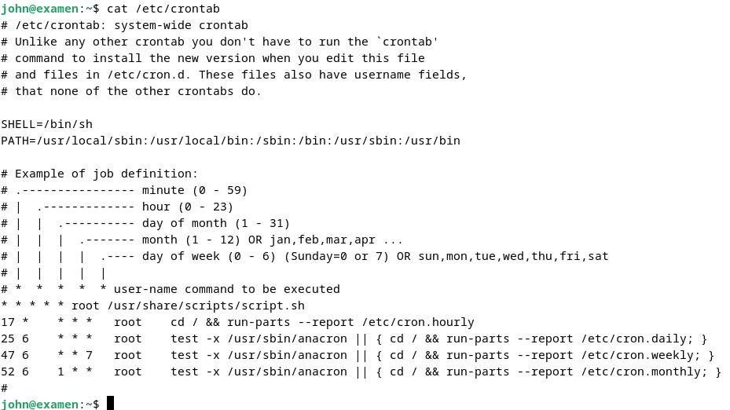

**Description**
- "cat /etc/crontab" : Nous pouvons voir qu'un cronjob s'exécute en tant que root et s'exécute tout le temps. Son chemin est "/usr/share/scripts/script.sh", en tant que user nous pouvons le modifier et donc lancer des commandes en tant que root via le script. 

**Rémédiation**
- Modifier les droits d'exécution du script.

# Vulnérabilité 8 #

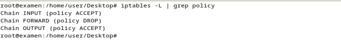

**Description**
- Il n'y a pas de firewall sur la machine, il n'y a donc pas de filtrage de flux : "iptables -L | grep policy".

**Rémédiation**
- Installer IpTables et faire des règles de filtrage de flux.

# Vulnérabilité 9 #

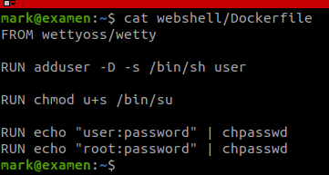

**Description**
- Dans le repertoir de l'utilisateur "mark", dans le fichier "/home/user/mark/webshell/Dockerfile", il y a des identifiants de connexion en clair.

**Rémédiation**
- Stocker les identifiants sous forme de hash, et traiter les conexions avec des inputs plutôt qu'avec des chaines de caractères.

# Vulnérabilité 10 #

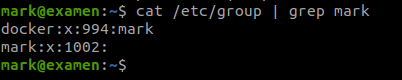

**Description**
- L'utilisateur "mark" est dans le group "docker" il a les privilèges root car le groupe Docker accorde les privilèges root aux utilisateurs au sein du groupe. 

**Rémédiation**
- Supprimer l'utilisateur "mark" du groupe docker.
